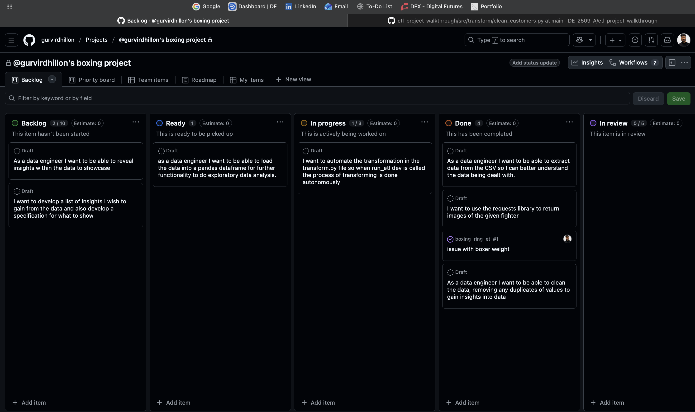
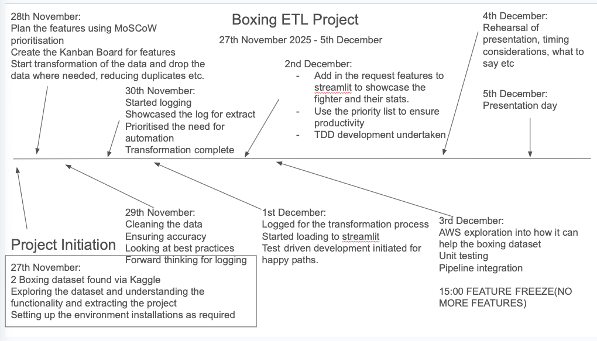

# README

## About Section

This project combined two datasets into the ETL pipeline. The project aims to combine a boxers data with information about fight results. 


## Installations

Prerequisite:  

- Python version 3+ available at the <a href="https://www.python.org/downloads/">python website.</A>
- Pip installation
- Git(to clone the repository)


Making a virtual environment(on windows):  

```terminal
python -m .venv venv
```

Going into the virtual environment
```terminal
source .venv/bin/activate
``` 

```
pip install streamlit ipykernel pandas pyarrow plotly pytest pytest-cov 
```

```terminal
pip install -r requirements.txt
```

```terminal
pip -e .
```


Run the ETL pipeline:

```terminal
run_app dev
```


## Project Management

To effectively manage the project, I used a project timeline to ensure full clarity on the features to be developed at the end of each sprint (which typically lasted one day). This allowed me to refer to the priority list and clearly understand which features needed to be implemented next.

MoSCoW prioritisation had become very effective within the core functionality of the application. This allowed me to categorise the features based on their importance level. This helped with continuous deployment as the priorities were placed on the must haves first which were essential to the delivery and initial deployment. Once these features were completed then the order of features were labelled as should, could, would.

<table>
  <tr>
    <th>Priority level</th>
    <th>Feature</th>
    <th>Reason for priority level</th>
    <th>Complete?</th>
  </tr>
  <tr>
    <td>Must</td>
    <td>Data must be extracted autonomously</td>
    <td>Core dependency - without extraction we would have no data to work with</td>
    <td><input type="checkbox" checked><td>
  </tr>
  <tr>
    <td>Must</td>
    <td>Data must be transformed and standardised to fit the data analysis requirements.</td>
    <td>Core dependency again as we would be working with data that would have inconsistencies making analysing the data difficult.</td>
    <td><input type="checkbox" checked><td>
  </tr>
  <tr>
    <td>Should</td>
    <td>Merge both datasets together after it has been cleaned showcasing fighter records with the appropriate attributes.</td>
    <td>Should as this will be able to reveal insights within the data.</td>
    <td><input type="checkbox" checked><td>
  </tr>
    <tr>
    <td>Should</td>
    <td>Generate synthetic dates which has a rule that a fighter cannot fight another individual on the same day.</td>
    <td>This is important as this can help to get the most up to date fighters record when analysing. Furthermore, more emphasis can be placed onto best of the year, most knockouts of the year, losses in the year etc</td>
    <td><input type="checkbox" checked><td>
    </tr>
   <tr>
    <td>Should</td>
    <td>Must be able to showcase the top 5 best performing individuals at every weight class</td>
    <td>Should because this is essential information when asking questions about the sport</td>
    <td><input type="checkbox"><td>
  </tr>
  <tr>
    <td>Could</td>
    <td>Who maintains the most knockout accuracy from every division?</td>
    <td>Could because this would be important to find out for which fighters are the most exciting</td>
    <td><input type="checkbox"><td>
    </tr>
        <tr>
    <td>Could</td>
    <td>Can utilise the requests library to scrape photos of fighters available on wikipedia to showcase the fighters attributes, records and their number of knockouts with other data.</td>
    <td>Could as this is not essential to the project but would make a nice addition as it would be nice to visualise the fighter with statistics.</td>
    <td><input type="checkbox" checked><td>
  </tr>

  <tr>
    <td>Would</td>
    <td>Create a probability for match-ups on who would most likely win given the fighters record.</td>
    <td>Would as this would require machine learning and the use of Scikit-learn. Given the time frame this may not be viable therefore has not been put as a priority. But will be considered a future work.</td>
    <td><input type="checkbox"><td>
  </tr>
</table>

#### Kanban

A Github Kanban-board was utilised for understanding the current project backlog and to visualise an overview of the current progress. This helped to understand the definition of "DONE" and during the sprints helped keep morale boosted to view achievements. As can be seen by <a href="#appendix1">appendix1</a>.



Moreover, kanban was integrated with github issues which played a fundamental role with tracking states of issues and where in the process of completion it currently lies.

#### Project timeline



### The rules of boxing

Boxing is a physical sport where both athletes are assessed by a series of judges on a round to round basis. Each athlete is scored on their performance. Things that may affect the score can be:

- Aggression
- Landing of punches(how clean the punches land)
- Defense
- Ring Generalship: which includes controlling of the pace, positioning and style of the fight. 

Points can also be deducted in the case of a knockdown or if foul play becomes evident.

The fight can either end by: 

- Technical Knockout: Where the referee/medic intervenes stating the fight cannot go on for the fighters safety.  

- Knockout: Ten seconds is given to the boxer to get on their feet after any part of their body other than their feet touches the canvas. If they do not get up after 10 seconds this results in a knockout victory favouring the person who landed the knockout punch.

- Point decision: Depending on the bout, rounds can last between 4 to 12 rounds depending on the experience level, if it is a championship bout. If the fight goes the distance(the whole way), judges score the contest and decide the winner based on performance of both fighters.

How it can be contested:


<table>
  <tr>
    <th>Decision</th>
    <th>Description</th>
  </tr>
  <tr>
    <td>Unanimous Decision</td>
    <td>This means that all the judges agree that fighter A's performance was better than fighter B's performance.</td>
  </tr>
  <tr>
    <td>Split Decision</td>
    <td>This is where two judges believe fighter A scored a better performance whereas one judge believes fighter B performed better.</td>
  </tr>
  <tr>
    <td>Majority decision</td>
    <td>This is where two judges believe fighter A had performed better however one judge believes it was a draw.</td>
  </tr>
  <tr>
      <td>Split Draw</td>
    <td>One judge scores fighter A, another judge scores boxer B and the third scores the performance a draw.</td>
  </tr>
  <tr>
      <td>Majority Draw</td>
    <td>Two judges rule the fight as a draw and the third scores one boxer as a winner. The match is scored as a draw.</td>
  </tr>
</table>


### Understanding the Data

A fighter is usually recognised from their "portfolio". Meaning the names of the other athletes they have faced and the difficulty of their competition. Which is why their "record" is crucial to them. "Won_a" and "Won_B" is the amount of fights the fighter has won before facing their current competition. Equally the same logic applies to lost_a, lost_b, draw_a and draw_b.

The prefix of _a and _b was used to differentiate the fighter from one another. For example "Canelo" vs "Crawford", Canelo may be fighter A and his attributes are highlighted as [column_attribute]_A and Crawford's attributes may be highlighted as [column_attribute]_B.

Class is an attribute linked to "weight". To fight an opponent one must fit the weight requirement which can be between a certain scale for example middleweight fighters must weigh between 154lbs-160lbs. The classification attribute was therefore created to highlight the weight class the fighters were fighting at.

## Data Transformation

<table>
  <tr>
  <tr>
  <caption>Boxing Match Dataset</caption>
  </tr>
    <th>Dataset</th>
    <th>Kept?</th>
    <th>Reason for keeping?</th>
    <th>Transformation process</th>
  </tr>
  <tr>
    <td>Age_A/Age_B</td>
    <td>Yes<input type="checkbox" checked=True></td>
    <td>May give us good insights into boxers performance by age demographic. From here</td>
    <td>If the value was null I generated a random age between 18 and 45 years. This is because if I was to use the mean demographic this can affect the distribution of the data and would hinder the analytical processing. The reason it would be 18 is because this is the youngest a boxer can become a professional by sanctioning bodies of boxing.</td>
  </tr>
    <tr>
    <td>reach_a/reach_b</td>
    <td>Yes<input type="checkbox" checked=True></td>
    <td>Reach was also a metric that was used. The hope was to see if a higher reach meant a higher chance of a knockout.</td>
    <td>Again numpy was used based on height to ensure that the height was proportionate to the reach. To ensure this accuracy height must be computed first.</td>
  </tr>
    <tr>
    <td>stance_A/stance_B</td>
    <td>Yes<input type="checkbox" checked=True></td>
    <td>Would be good to analyse if different stances have a higher percentage of a knockout. May be used as a potential future work.</td>
    <td>Had cleaned the data by removing whitespacing, outliers in the data, placing a probability of the boxer being "orthodox", "southpaw" based on my own experience of watching boxing.</td>
  </tr>
    <tr>
    <td>weight_A/weight_B</td>
    <td>Yes<input type="checkbox" checked=True></td>
    <td>This was crucial for classifying the boxer by weight category.</td>
    <td>The transformation had used a range between 40 and 130 if the height wasn't accounted for. But if the height was accounted for it would use a Numpy distribution depending on the boxers height. The taller the boxer is the more likely they are to have a higher weight.</td>
  </tr>
    <tr>
    <td>height_a/height_b</td>
    <td>Yes<input type="checkbox" checked=True></td>
    <td>Further data can be analysed to see if having height can affect performance(more wins, going on points etc)</td>
    <td>This was an estimate based on the classification of their weight. Depending on their weight I would utilised the Numpy library to create a distribution where it assigns a numeric value based on the boxers height. If weight is not filled in it would get the average height.</td>
  </tr>
  <tr>
    <td>won_A/won_B</td>
    <td>Yes<input type="checkbox" checked=True></td>
    <td>This was used to find the amount of wins a fighter may have on their record. This can help to produce the best of all time as a table.</td>
    <td>The mean of the wins was computed of the current number of wins was complete. I also used a validation metric which would find a in between value for the number of fights a fighter would have over the span of their career. Typically a fighter would have 50 fights over their career but this was raised higher in the case of anomalies. Furthermore, turning the positive to integer was done to prevent unclean data.</td>
  </tr>
  <tr>
  <td>lost_A/lost_B</td>
    <td>Yes<input type="checkbox" checked=True></td>
    <td>This can help to produce loss leaders in the different divisions.</td>
    <td>On average the loss rate compared to win rate within boxing is higher therefore, if na fill a number between 0 and 130(inclusive). This is due to higher level of competition within boxing.</td>
  </tr>
  <tr>
  <td>drawn_A/drawn_B</td>
    <td>Yes<input type="checkbox" checked=True></td>
    <td>As wins and losses were accounted, draws would allow for a holistic view of boxing as a whole.</td>
    <td>The draw rate was set between 0 and 20 for values and a median was drawn from the given distribution of drawn_a and drawn_b columns</td>
  </tr>
    <tr>
  <td>kos_A/kos_B</td>
    <td>Yes<input type="checkbox" checked=True></td>
    <td>This would allow us to see the knockout percentage of the individual when boxing and how many fights go to points.</td>
    <td>The data was standardised to ensure that knockouts are never above the number of wins.</td>
  </tr>
  <tr>
  <td>result</td>
    <td>Yes<input type="checkbox" checked=True></td>
    <td>I chose to keep the results as boxing matches require the end result and many attributes such as wins requires results. For future work incrementing the boxers wins dynamically will be taken into account.</td>
    <td>Results required to see many attributes such as the judges scorecards and to summarise the score cards. Whoever had returned a higher sum was declared the winner. Otherwise the bout would end in a draw.</td>
  </tr>
  <tr>
  <td>decision</td>
    <td>Yes<input type="checkbox" checked=True></td>
    <td>This was used to show what decision had formed whether it was a disqualification/knockout etc. This was used to see the amount of knockouts, unanimous decisions and other forms of decisions within boxing as a future work</td>
    <td>Decision was messy data in itself. It was stripped. Placed in upper casing for standardisation and replaced with abbreviations.</td>
  </tr>
  <tr>
  <td>judge1_A/.../judge3_B
</td>
    <td>Yes<input type="checkbox" checked=True></td>
    <td>Would be interesting to see what each judge scored the contest.</td>
    <td>If the value was null for judge1_B, the transformation process would first identify the location of the row and estimate the average score of all the other judges. If not it would then do a fall back by giving the contest 114.</td>
  </tr>
</table>


<table>
  <tr>
  <tr>
  <caption>Fighter Dataset</caption>
  </tr>
    <th>Dataset</th>
    <th>Kept?</th>
    <th>Reason for keeping?</th>
    <th>Transformation process</th>
  </tr>
  <tr>
    <td>Rating</td>
    <td>No<input type="checkbox"></td>
    <td>Not needed for the purpose of this etl project</td>
    <td>Dropped column</td>
  </tr>
  <tr>
    <td>Boxer</td>
    <td>Yes<input type="checkbox" checked=True></td>
    <td>Need to know the name of the fighter</td>
    <td>Dropped any na values</td>
  </tr>
    <tr>
    <td>Country</td>
    <td>Yes<input type="checkbox" checked=True></td>
    <td>Need to know the originality of the fighter for Tableau/streamlit analysis.</td>
    <td>Dropped any na records for fighters without countries.</td>
  </tr>  
    <tr>
    <td>Weight</td>
    <td>Yes<input type="checkbox" checked=True></td>
    <td>Needed information about the fighters natural weight class. This can then be brought over to the weight classes and as a future work I plan on matching the fighters weight from the dataset with the fighter weight on the other dataset.</td>
    <td>Standardised the weight by converting lbs to kg so when merging datasets this will ensure a standardised format of weight. I did this by getting the current lbs data in the fighters dataset and multiplying by 0.0.45359(found by a conversion on google)</td>
  </tr>  
      <tr>
    <td>Ceiling</td>
    <td>No<input type="checkbox"></td>
    <td>Unneeded - out of the scope of the project</td>
    <td>Dropped column</td>
  </tr>
    <tr>
    <td>Action</td>
    <td>No<input type="checkbox"></td>
    <td>Unneeded - out of the scope of the project</td>
    <td>Dropped column</td>
  </tr>  
      <tr>
    <td>Trainer</td>
    <td>No<input type="checkbox"></td>
    <td>Unneeded - out of the scope of the project</td>
    <td>Dropped column</td>
  </tr>  
    <tr>
    <td>Sex</td>
    <td>Yes<input type="checkbox"></td>
    <td>Would be interesting to see the number of males/females for analysis.</td>
    <td>Data was already clean.</td>
  </tr> 
</table>

decision

### Git branches

- main  

This is the production environment which was used when a feature was finalised and ready to deploy. Upon feature completion a merge/pull request was done to ensure there were minimal merge conflicts. Furthermore, this had helped to promote working in silos before merging into the production environment(which in this case was main).

- etl-test  

Was used to test the code, all the functions as well as to work on the different folders within the tests.

- etl-transform 
 
Was used to transform the csv changes after extraction and to clean the data. This would play a crucical role when comparing the two csv files with other branches.

- viz  

This branch was used to visualise the streamlit app once the load process was complete. This was also used to demonstrate the etl pipleine integration when running ```run_app dev``` it would run the streamlit app in parallel displaying the data as required.

### Further discussion

<table>
  <tr>
    <th>Subject</th>
    <th>Description</th>
    <th>Link</th>
  </tr>
  <tr>
    <td>AWS Service Integration plan</td>
    <td>As AWS is a scalable resource the markdown provided would allow me to plan how I would shift over this ETL project to the cloud. The markdown provides the reasons why this may be of benefit as well as the potential way this would be completed.</td>
    <td><a href="docs/AWS.md">AWS Documentation</a></td>
  </tr>
  <tr>
    <td>Boxing dataset location</td>
    <td>Reference: Kaggle Dataset. This dataset was open source and was extracted as a csv file.</td>
    <td><a href="https://www.kaggle.com/datasets/iyadelwy/boxing-matches-dataset-predict-winner/data">Boxer Dataset</a></td>
  </tr>
  <tr>
    <td>Fixture dataset</td>
    <td>Reference: Kaggle Dataset. This data was extracted as a csv file. Contains 25MB of data.</td>
    <td><a href="https://www.kaggle.com/datasets/mexwell/boxing-matches">Boxing matches</a></td>
  </tr>
</table>
